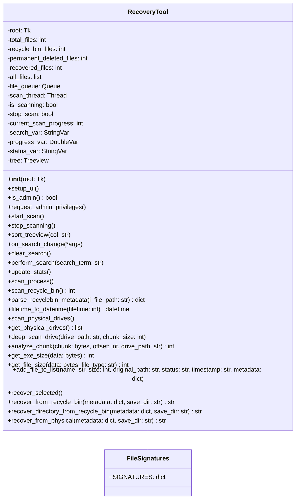

```mermaid
classDiagram
    class RecoveryTool {
        -root: Tk
        -total_files: int
        -recycle_bin_files: int
        -permanent_deleted_files: int
        -recovered_files: int
        -all_files: list
        -file_queue: Queue
        -scan_thread: Thread
        -is_scanning: bool
        -stop_scan: bool
        -current_scan_progress: int
        -search_var: StringVar
        -progress_var: DoubleVar
        -status_var: StringVar
        -tree: Treeview
        +__init__(root: Tk)
        +setup_ui()
        +is_admin() bool
        +request_admin_privileges()
        +start_scan()
        +stop_scanning()
        +sort_treeview(col: str)
        +on_search_change(*args)
        +clear_search()
        +perform_search(search_term: str)
        +update_stats()
        +scan_process()
        +scan_recycle_bin() int
        +parse_recyclebin_metadata(i_file_path: str) dict
        +filetime_to_datetime(filetime: int) datetime
        +scan_physical_drives()
        +get_physical_drives() list
        +deep_scan_drive(drive_path: str, chunk_size: int)
        +analyze_chunk(chunk: bytes, offset: int, drive_path: str) int
        +get_exe_size(data: bytes) int
        +get_file_size(data: bytes, file_type: str) int
        +add_file_to_list(name: str, size: int, original_path: str, status: str, timestamp: str, metadata: dict)
        +recover_selected()
        +recover_from_recycle_bin(metadata: dict, save_dir: str) str
        +recover_directory_from_recycle_bin(metadata: dict, save_dir: str) str
        +recover_from_physical(metadata: dict, save_dir: str) str
    }

    class FileSignatures {
        +SIGNATURES: dict
    }

    RecoveryTool -- FileSignatures
```
